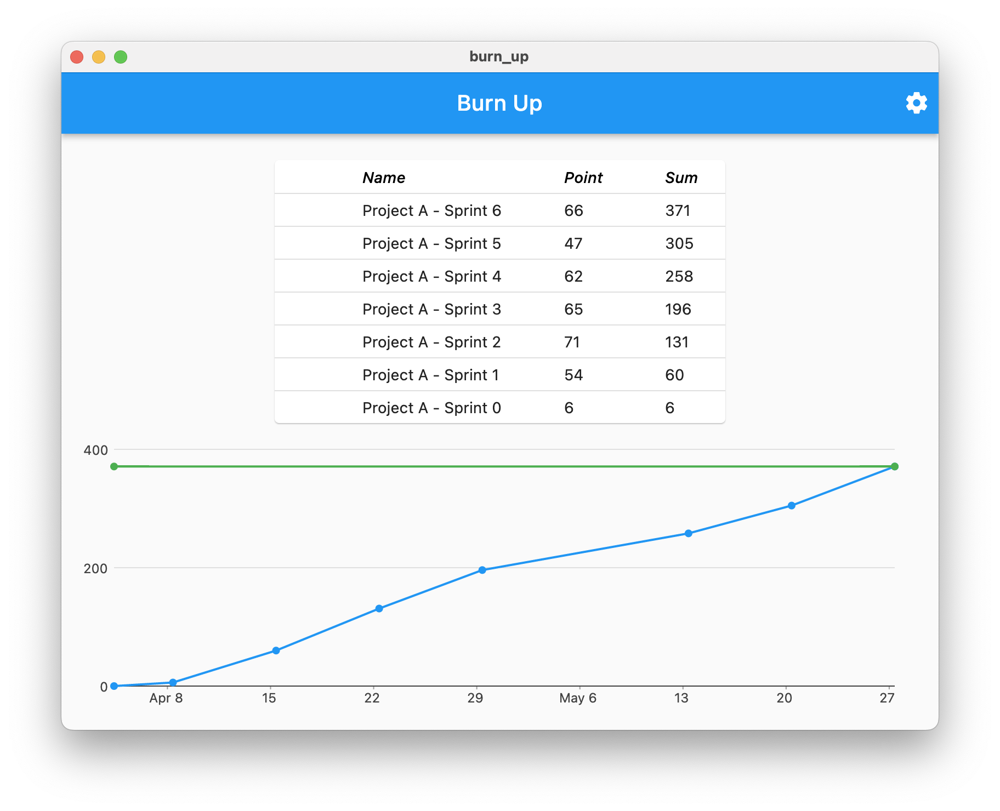
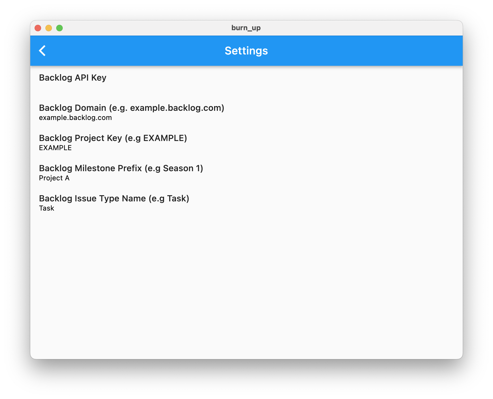

# Burn Up

Inspired by [shomatan/backlog-burnup](https://github.com/shomatan/backlog-burnup)



## Development

### Install dependencies
```
$ flutter pub get
```

### Generate entities using freezed
```
$ flutter pub run build_runner build
```

### Run
```
$ flutter run
```

## Usage
- Click the gear icon on the right-top to open settings
- Set settings of your project

- Restart the app (We plan to improve to apply settings without restarting.)

## How it works

### Milestones
- Sprint milestone
    - Each sprint milestones should contain `Sprint` in its name
    - Set begin and end date to each sprint milestones. It helps to show Burn-up Chart properly.
    - To expand the Burn Up Chart period to know when achieve the total story point, need to create enough sprint milestones.
- Release milestone
    - Release milestone should contain `Release` in its name.

### Issues
All issues should have two milestones, release milestone and sprint milestone.

> e.g `Issue 1` has `Project A - Release` and `Project A - Sprint 0` milestones.
> 

## Todo
### Features
- Apply settings without restarting
- Select a project and an issue type using a dropdown

### Development
- Add unit tests
- Refactor a bloc architecture
